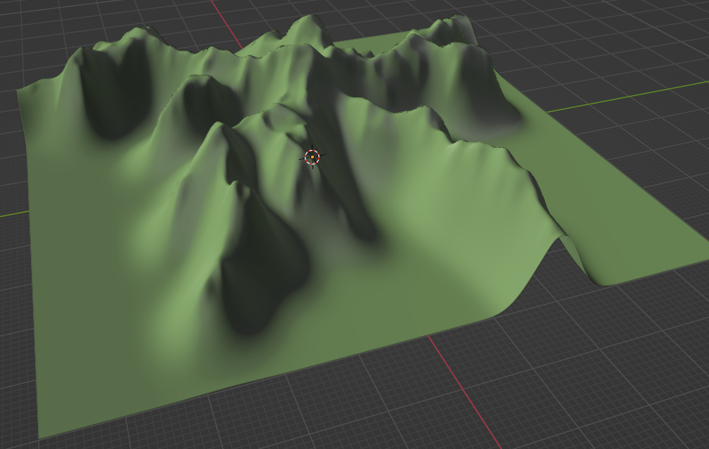

# Mountain Maker

Mountain Maker is a Rust application that procedurally generates 3D terrain meshes using Diffusion Limited Aggregation (DLA) algorithms. The program creates realistic-looking mountains and terrain that can be exported to GLB format for use in 3D applications.



## Features

- Generate procedural 3D mountains using Diffusion Limited Aggregation
- Control the simulation parameters via command line arguments
- Export the results as GLB 3D model files
- Reproducible terrain generation using optional random seeds
- Multi-step refinement process with optional intermediate step saving

## Installation

### Prerequisites

- Rust toolchain (cargo, rustc)
- GLB viewer for viewing the exported 3D models

### Building from Source

```bash
git clone https://github.com/yourusername/mountain-maker.git
cd mountain-maker
cargo build --release
```

## Usage

Run the application with default settings:

```bash
cargo run
```

### Command-Line Options

```
Usage: mountain-maker [OPTIONS]

Options:
      --width <WIDTH>                      Width of the simulation grid [default: 200]
      --height <HEIGHT>                    Height of the simulation grid [default: 200]
      --particles <PARTICLES>              Number of particles to simulate [default: 5000]
      --stickiness <STICKINESS>            Particle stickiness (0.0-1.0) [default: 0.7]
      --step-size <STEP_SIZE>              Random walk step size [default: 1]
      --blur-radius <BLUR_RADIUS>          Blur radius for smoothing [default: 8]
      --upsample-factor <UPSAMPLE_FACTOR>  Upscaling factor for each iteration [default: 2]
      --steps <STEPS>                      Number of refinement steps [default: 4]
      --blur-strength <BLUR_STRENGTH>      Blur strength (0.0-1.0) [default: 0.7]
      --seed <SEED>                        Random seed for reproducible terrain generation
  -o, --output <OUTPUT>                    Output path for the GLB file [default: mountain_mesh.glb]
      --scale-x <SCALE_X>                  X-axis scale factor [default: 1]
      --scale-y <SCALE_Y>                  Y-axis scale factor [default: 1]
      --scale-z <SCALE_Z>                  Z-axis height scale factor [default: 200]
      --save-steps                         Save intermediate step files
      --step-dir <STEP_DIR>                Directory to save intermediate step files
  -h, --help                               Print help
  -V, --version                            Print version
```

### Examples

Generate a terrain with a specific seed for reproducibility:

```bash
cargo run -- --seed 123456
```

Generate a larger, more detailed terrain:

```bash
cargo run -- --width 300 --height 300 --particles 10000 --steps 5
```

Adjust the terrain shape with different parameters:

```bash
cargo run -- --stickiness 0.8 --scale-z 300 --blur-radius 10
```

Save intermediate steps for visualization:

```bash
cargo run -- --save-steps --step-dir step_outputs
```

## How It Works

1. The application runs a Diffusion Limited Aggregation simulation in 2D
2. The simulation result is converted to a height map
3. Multiple steps of upsampling and blurring refine the terrain
4. The final height map is converted to a 3D mesh
5. The mesh is exported as a GLB file for use in 3D applications

## License

This project is licensed under the MIT License - see the LICENSE file for details.

## Acknowledgments

- The mesh-tools crate for 3D mesh handling and export
- The glam crate for vector mathematics
- The clap crate for command-line argument parsing
